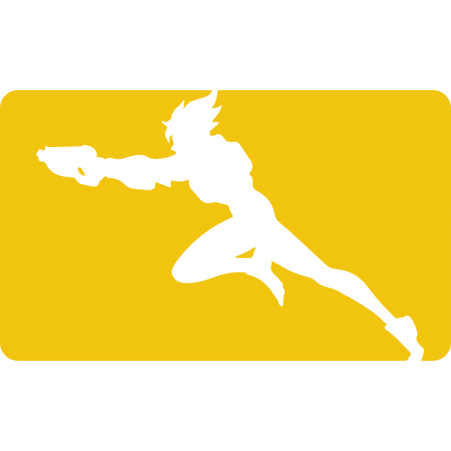
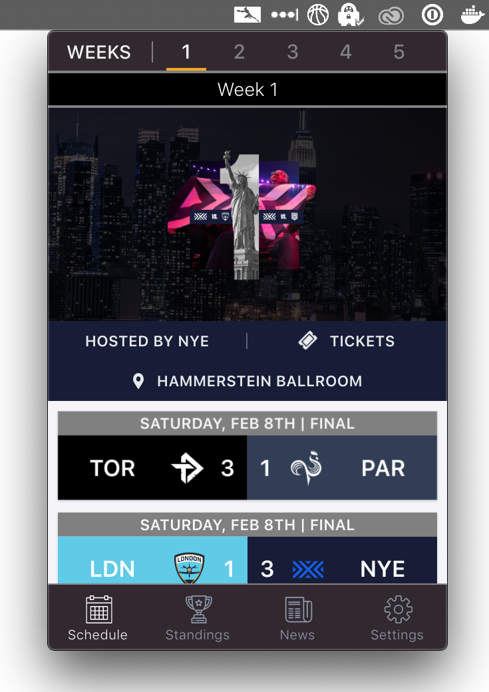
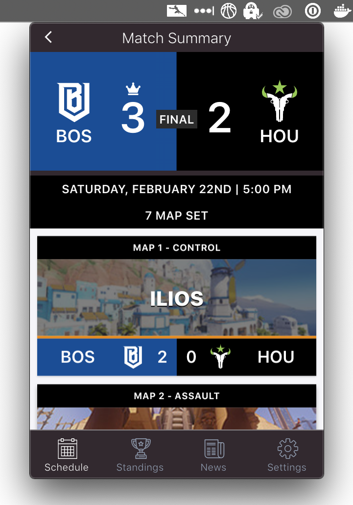
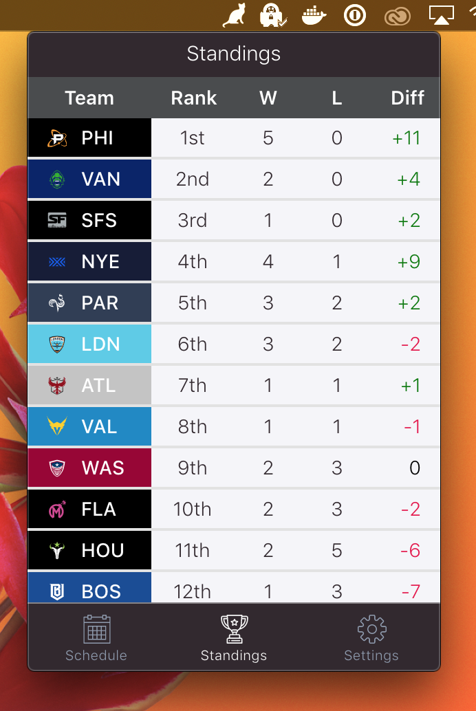

  
  <h3 align="center">Overwatch League Bar</h3>
  
Follow Overwatch League right on your desktop!

# About

OWL Bar is bringing Overwatch League to your desktop. Stay up to date on matches, standings, and league news!

 

## Features ✨

### Schedule

View weekly schedules, including scores for previous matches, and more.

### Standings

Check out up-to-date standings and see how your favorite team stack up with the rest of the league.

### Previews

Gearing up for a future match? See how two teams match up against each other.

# Download Today!

---

# Disclaimer

Overwatch League Bar isn’t endorsed or in any way affiliated with Blizzard Entertainment and doesn’t reflect the views or opinions of Blizzard Entertainment or anyone officially involved in producing or managing Overwatch. Overwatch, Overwatch League, and Blizzard Entertainment are trademarks or registered trademarks of Blizzard Entertainment, Inc. in the U.S. and/or other countries. All submitted art content remains copyright of its original copyright holder.
