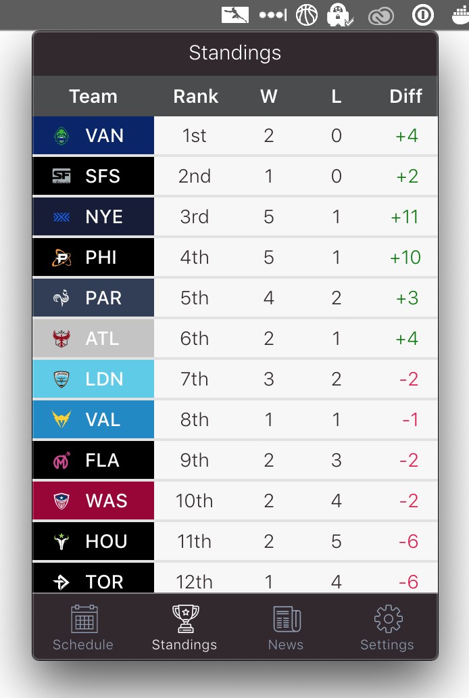

# Overwatch League Bar

Follow Overwatch League right on your desktop! (WIP)

<p display="flex">



</p>

## Bundle Issue

This current branch displays a blank app after running the command `npm run electron-pack`. It produces the following error in the developer tools.

```
Not allowed to load local resource: file:///Applications/OWL%20Bar.app/Contents/Resources/app.asar/index.html
```

## Reproduction Steps

1. Switch the current branch over to `menubar` on Github. Then, clone the branch.
2. Navigate to the project branch, then install dependencies with `yarn`.
3. Run `npm run electron-pack` to build the project.
4. Navigate to the `dist` directory, and install the app for your OS
   1. MacOS: Select `OWL Bar-0.1.0.dmg`
   2. Windows: Select `OWL Bar Setup 0.1.0.exe`
5. Click on the menu icon (it should be a white cat for now). Then you should see a blank white app.

The main build file is located in `public/electron.js`. This points Electron to `build/index.html`.

The `build` property in `package.json` lists files to include in the final build:

```
"files": [
  "build/",
  "public/electron.js"
],
```

It should include the `build` directory produced by `create-react-app`'s build script, and the electron script used to launch the app.
